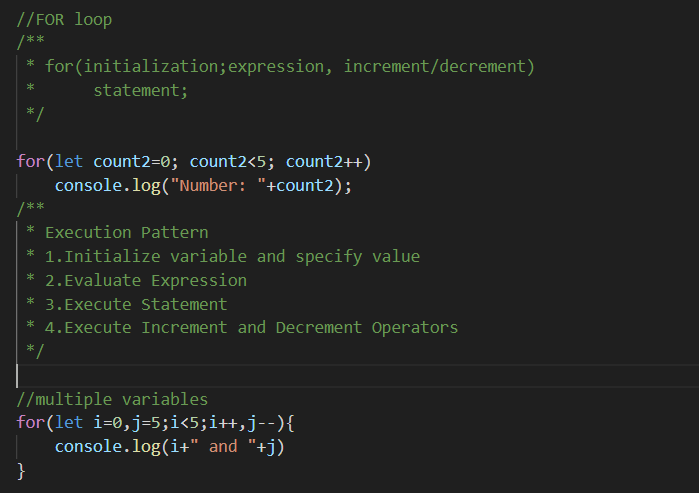

<h2>Introduction to JavaScript</h2>

<table style="border: none  padding: 10px;">
    <tr>
        <td><li>Js is a client-side scripting language that execute on your broweser. </li>
            <li>Js essentially used to make your pages alive</li>
            <li>Using Js we can capture event, create animations, validating user inputs and much more.</li>
            <li>In present Js not only execute on browser but also on the server.</li>
            <li>Node.js is one of the most amazing example of server-side JavaScript</li>
        </td>
        <td>  </td>
 </tr>
</table>

<h3>History of JavaScipt</h3>
   <li>Js was developed by Brendan Eich in Netscape Communications Corporation in 1995</li>
   <li>JavaScript started his life with the name Mocha ans was concisely named LiveScript.</li>
    <li>In 1995 LiveScript officially renamed to JavaScript with Netscape Navigator Road leads</li>
    

<h3>What is ECMAScript</h3>
   <li>ECMA stands for Europian Computer Manufacturers Association, a private international nonprofit standard organization.</li>
   <li>In 1996 Netscape submitted JavaScript to ECMA.</li>
   <li>JavaScript is implementation of ECMAScript.</li>
   

<h3>What is ES6</h3>
   <li>ECMAScript 6 is update of ES5 which was standardize in 2009.</li>
   <li>ES6 was published by ECMA International in June 2015.</li>

<h3>Literals, Variables & Constants</h3>
<table style="border: none  padding: 10px;">
    <tr>
        <td>Variables</td>
        <td><li>Variable is a name that contains a specific value</li></td>
    </tr>
    <tr>
        <td>Constant</td>
        <td><li>In ES6 a new Keyword added in the JavaScript which is const.</li>
        <li>Constant also hold value but unlike variables it can't be changed after initialization.</li>
    </tr>
    <tr>
        <td>Identifier</td>
        <td><li>Variables and constants are usually call identifier.</li>
        <li>Identifier consists of letters numbers Underscore(_) and the Dollar ($) sign.</li>
        <li>Unicode Characters are allowed</li>
        <li>Identifier must start with the letter Dollar sign ($) or underscore(_).</li>
        <li>Identifier cannot be a reserved word.(words that created for a specific task).</li>
        </td>
    </tr>
    <tr>
        <td>Literals</td>
        <td><li>You are providing a value directly in the program.</li>
        <li>Literals is just the way to create identifier with the value.</li>
    </tr>
</table>

<h3>Primitive Type & Object</h3>
<h4>Primitive Types</h4>

JavaScript Data or values are primitive or object. Primitive data are immutable means we cannot change the value of the variable after initializing JS recognized four types of numerical literals, Binary, Decimal, Octal, HexaDecimal.

<h4>Boolean</h4> 

 Boolean is just a value type that have only two possible values. True or False. We dont use boolean values inside quotaion marks.("")

<h4>Symbols</h4> 

In ecmascript 6 we have a new type symbol. Symbols is the new data type in es6 which represent Unique tokens. Once you created a symbol it is unique and it will not match any other symbols.

<h4>Null & Undefined</h4> 

JS has two special types null and undefined. Null has only one possible value which is Null and undefined has only one possible value undefined Both Null and undefined Represent something doesn't exist.

<!--Tutorial 05 -->

<h4>Object Types</h4>
<li>Array</li>
<li>Date</li>
<li>Regular Expression</li>
<li>Map & WeakMap</li>
<li>Set and WeakSet</li>

<h4>What is Object?</h4>
<li>Objects are mutable</li>
<li>Can change any value anytime.</li>
<li>Object is just like a Container that can have different kind of data.</li>
<li>Object literal syntax :{} </li>

<h4>Array</h4>
<li>Array is Collection of Different types of Data.</li>
<li>Array Start with [0] and end with [n] value.</li>
<li>Array element can be any type of of data, It may be objects or primitive type.</li>
<li>Array size is not fixed so you can add and remove array element anytime.</li>
<li>Array is zero based. So the first element of the array is 0 next element is 1 and so on.</li>

<h4>Date</h4>
<li>Represent date and time using date object.</li>

<h4>Date</h4>
<li>Represent date and time using date object.</li>

<h4>Regular Expression</h4>
<li>It is a sub language of JavaScript</li>
<li>Used to perform Complex search and replace operations on strings.</li>

<h4>Maps and Sets</h4>
<li>In new ECMAScript 6 a new data type introduced is map and set and their week counterpart, WeekMap and Weakset.</li>
<li>Maps are just likean object but it offers more advantages than object in certain situations</li>
<li>Set are similar to array expect they can't content duplicate element.</li>

<!--Tutorial 06 -->
<h4>String</h4>
<li>A Collection of characters, Numbers, and Symbols.</li>
<li>In Js string represents UNICODE TEXT<li>Unicode text is a computing industrial standard for representing text data.</li><li>Unicode store letter and characters By assigning a number of each one.</li></li>
<li>Special Chracters</li>
<table>
    <tr>
        <td>Escaping Characters</td>
        <td>Description</td>
    </tr>
    <tr>
        <td>\n</td>
        <td>New line</td>
    </tr>
    <tr>
        <td>\r</td>
        <td>Carriage Return</td>
    </tr>
    <tr>
        <td>\t</td>
        <td>Tab</td>
    </tr>
    <tr>
        <td>\' & \"</td>
        <td>Single & Double Quote</td>
    </tr>
    <tr>
        <td>\`</td>
        <td>Backtick (new ES6)</td>
    </tr>
    <tr>
        <td>\$</td>
        <td>Dollar Sign (new ES6)</td>
    </tr>
    <tr>
        <td>\\</td>
        <td>Backslash</td>
    </tr>
    <tr>
        <td>\\uXXXX</td>
        <td>Unicode Format</td>
    </tr>
    
</table>

<!--Tutorial 07 -->

<h4>If & Else</h4>

<!--Tutorial 08 -->
<h4>Switch</h4>

<!--Tutorial 09 -->
<h4>Loop</h4>
<li>While Loop</li>

<!--Tutorial 10 -->
<li>Do while Loop</li>

<!--Tutorial 11 -->
<li>for Loop</li>

<!--Tutorial 12 -->
<li>Nested for Loop</li>

<!--Tutorial 13 -->
<li>for/in  Loop</li>

<!--Tutorial 14 -->
<li>for/of  Loop</li>

<!--Tutorial 15 -->
<h4>Expressions</h4>
<li>Expression is a statement that evaluate to a value</li>

<h5>Primary Expression/ Simple Expression</h5>

Constant or literal values, it can be variable reference or certain language result keywords

<li>5.30- number literals </li>
<li>"Name" - String literals</li>
<li></li>

<h5>JavaScript Reserve Words</h5>
<li>Null</li>
<li>True</li>
<li>False</li>

<h5>Bare Expressions</h5>
<li>str - expression evaluate to the value of the str</li>
<li>undefined - it is a global variable , not a keyword like null</li>
<li>False</li>

<!--Tutorial 16-24-->
<h4>Operators</h4>
<li>Assignment Operators</li>
<li>Arithmetic Operators</li>
<li>Comparison Operators</li>
<li>String Operators</li>
<li>Logical Operators</li>
<li>Bitwise Operators</li>
<li>Ternary Operators</li>
<li>Type Operators</li>
<table>
    <tr>
        <td>Operator</td>
        <td>Description</td>
    </tr>
    <tr>
        <td>typeof</td>
        <td>Returns the type of a variable</td>
    </tr>
    <tr>
        <td>instanceof</td>
        <td>Returns true if an object is an instance of an object type</td>
    </tr>
</table>
<li>Destructing Assignment Operator</li>

It is new in EcmaScript 6

<!--Tutorial 25-->
<h4>Object and Array Operators</h4>

<!--Tutorial 26-->
<h4>instanceof Operator</h4>

<h4>Delete Operator</h4>

<h4>Conditional Operators</h4>

<!--Tutorial 27,28-->
<h4>Jump Statements</h4>
<li>jump statement are used to jump the execution to the new location</li>

<h4>Labeled Statements</h4>
<li>allow us to specify name to the specific block that can refer it to somewhere in the program</li>

<h4>Continue Statements</h4>
<li>Restart the loop after next iteration</li>

<h4>Return Statements</h4>

<!--Tutorial 29-->
<h4>Functions</h4>
<li>Declare with function keyword followed by function name</li>
<li>parameters are optional</li>

<!--Tutorial 30-->
<h4>Function Arguments & Defualt Arguments</h4>
<h5>Function Arguments</h5>

<h5>Default Arguments</h5>

<!--Tutorial 25-->
<h4></h4>
<li></li>

